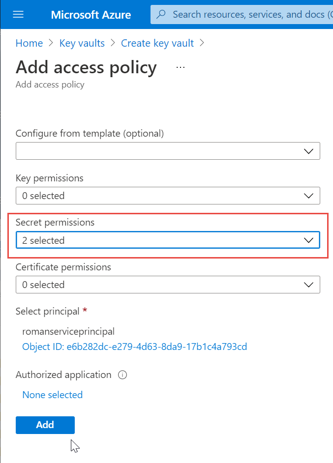
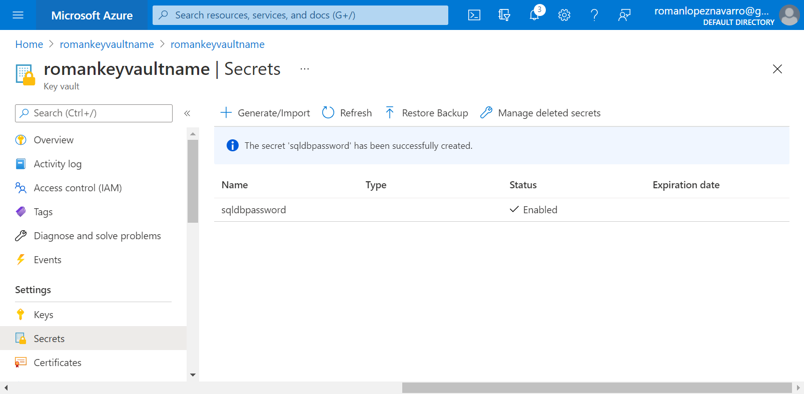
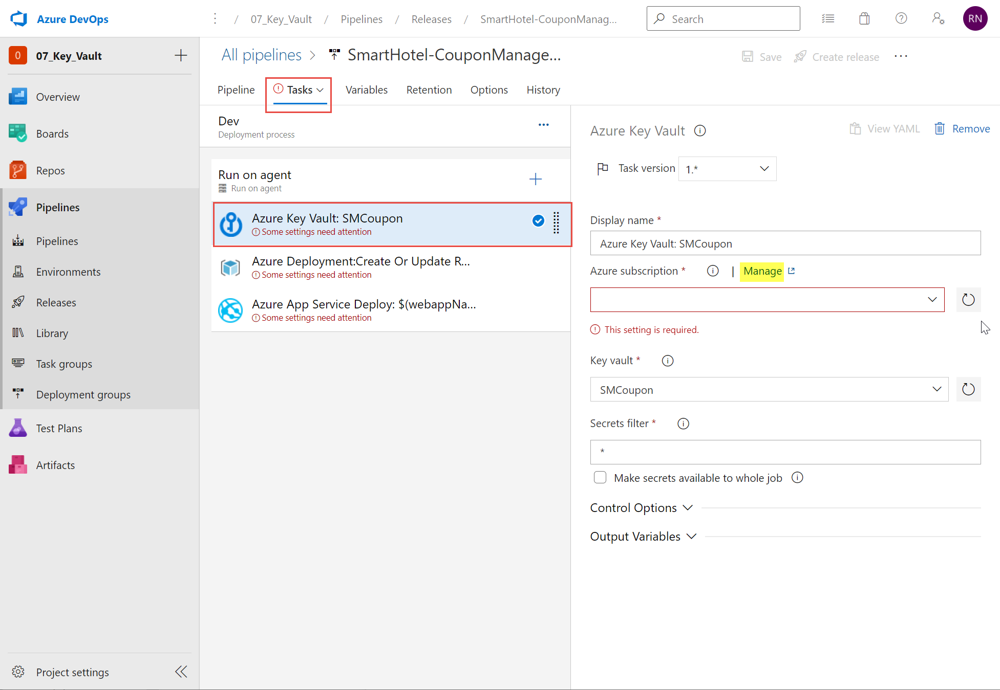

# Lab 07: Integrating Azure Key Vault with Azure DevOps
# Student lab manual

## Lab overview

Azure Key Vault provides secure storage and management of sensitive data, such as keys, passwords, and certificates. Azure Key Vault includes supports for hardware security modules, as well as a range of encryption algorithms and key lengths. By using Azure Key Vault, you can minimize the possibility of disclosing sensitive data through source code, which is a common mistake made by developers. Access to Azure Key Vault requires proper authentication and authorization, supporting fine grained permissions to its content.

In this lab, you will see how you can integrate Azure Key Vault with an Azure DevOps pipeline by using the following steps:

- create an Azure Key vault to store a MySQL server password as a secret.
- create an Azure service principal to provide access to secrets in the Azure Key vault.
- configure permissions to allow the service principal to read the secret.
- configure pipeline to retrieve the password from the Azure Key vault and pass it on to subsequent tasks.

## Objectives

After you complete this lab, you will be able to:

-   Create an Azure Active Directory (Azure AD) service principal.
-   Create an Azure key vault. 
-   Track pull requests through the Azure DevOps pipeline.

## Lab duration

-   Estimated time: **40 minutes**

## Instructions

### Before you start

#### Sign in to the lab virtual machine

Ensure that you're signed in to your Windows 10 virtual machine by using the following credentials:
    
-   Username: **Student**
-   Password: **Pa55w.rd**

#### Review applications required for this lab

Identify the applications that you'll use in this lab:
    
-   Microsoft Edge

#### Prepare an Azure subscription

- Identify an existing Azure subscription or create a new one.

- <a name="role_owner"></a>Verify that you have a Microsoft account or an Azure AD account with the Owner role in the Azure subscription and the Global Administrator role in the Azure AD tenant associated with the Azure subscription. For details, refer to [List Azure role assignments using the Azure portal](https://docs.microsoft.com/en-us/azure/role-based-access-control/role-assignments-list-portal) and [View and assign administrator roles in Azure Active Directory](https://docs.microsoft.com/en-us/azure/active-directory/roles/manage-roles-portal#view-my-roles).

  Mi usuario sí tenía el rol de ***Global administrator***.

  

  

  Pero no tenía el rol de ***Owner*** y tuve que añadirlo desde **Subscriptions / Azure Pass - Sponsorship => +Add**.

  

  

  

  

  

  

#### Set up an Azure DevOps organization

If you don't already have an Azure DevOps organization that you can use for this lab, create one by following the instructions available at [Create an organization or project collection](https://docs.microsoft.com/en-us/azure/devops/organizations/accounts/create-organization?view=azure-devops).

### Exercise 0: Configure the lab prerequisites

In this exercise, you will set up the prerequisite for the lab, which consists of the preconfigured Parts Unlimited team project based on an Azure DevOps Demo Generator template.

#### Task 1: Configure the team project

In this task, you will use Azure DevOps Demo Generator to generate a new project based on the **Azure Key Vault** template.

<a name="create_project_devops"></a>Como en las prácticas anteriores del módulo y para facilitar la creación del proyecto a partir de una plantilla, primero entrar en *portal.azure.com* y situarse en el **DEFAULT DIRECTORY** de la cuenta si no lo estuviéramos ya, y clic en **Azure DevOps organizations**.


Pulsar en **My Azure DevOps Organizations**.


Seleccionar la cuenta de trabajo, y en la nueva ventana elegir en el desplegable **Default Directory**. Si vuelve a pedir una cuenta, entrar con la misma.


Desde otra pestaña del browser ir al [Azure DevOps Demo Generator](https://azuredevopsdemogenerator.azurewebsites.net) como se explica en el paso siguiente.

1.  On your lab computer, start a web browser and navigate to [Azure DevOps Demo Generator](https://azuredevopsdemogenerator.azurewebsites.net). This utility site will automate the process of creating a new Azure DevOps project within your account that is prepopulated with content (work items, repos, etc.) required for the lab. 

    > **Note**: For more information on the site, see https://docs.microsoft.com/en-us/azure/devops/demo-gen.

1. Click **Sign in** and sign in using the Microsoft account associated with your Azure DevOps subscription.

1. If required, on the **Azure DevOps Demo Generator** page, click **Accept** to accept the permission requests for accessing your Azure DevOps subscription.

1. On the **Create New Project** page, in the **New Project Name** textbox, type **Integrating Azure Key Vault with Azure DevOps**, in the **Select organization** dropdown list, select your Azure DevOps organization, and then click **Choose template**.

1. On the **Choose a template** page, in the header menu, click **DevOps Labs**, in the list of templates, click the **Azure Key Vault** template, and then click **Select Template**.

   

   

1. Back on the **Create New Project** page, select the checkbox below the **ARM Outputs** label, and click **Create Project**

   > **Note**: Wait for the process to complete. This should take about 2 minutes. In case the process fails, navigate to your DevOps organization, delete the project, and try again.

   

   

1. On the **Create New Project** page, click **Navigate to project**.

   

   

### Exercise 1: Integrate Azure Key Vault with Azure DevOps

- create an Azure <mark>service principal</mark> that will provide access to secrets in an Azure Key vault.
- create the Azure <mark>Key vault</mark> to store a MySQL server password as a secret.
- configure <mark>permissions</mark> to allow the service principal to read the secret.
- configure <mark>pipeline</mark> to retrieve the password from the Azure Key vault and pass it on to subsequent tasks.

#### Task 1: Create a service principal 

In this task, you will create a service principal by using the Azure CLI. 

> **Note**: If you do already have a service principal, you can proceed directly to the next task.

You will need a service principal to deploy an app to an Azure resource from Azure Pipelines. Since we are going to retrieve secrets in a pipeline, we will need to grant permission to the service when we create the Azure Key vault. 

A service principal is automatically created by Azure Pipeline when you connect to an Azure subscription from inside a pipeline definition or when you create a new service connection from the project settings page. You can also manually create the service principal from the portal or using Azure CLI and re-use it across projects. It is recommended that you use an existing service principal when you want to have a pre-defined set of permissions.

1. From the lab computer, start a web browser, navigate to the [**Azure Portal**](https://portal.azure.com), and sign in with the user account that has the ***Owner*** role in the Azure subscription you will be using in this lab and has the role of the ***Global Administrator*** in the Azure AD tenant associated with this subscription.

1. In the Azure portal, click the **Cloud Shell** icon, located directly to the right of the search textbox at the top of the page. 

1.  If prompted to select either **Bash** or **PowerShell**, select **Bash**. 

   >**Note**: If this is the first time you are starting **Cloud Shell** and you are presented with the **You have no storage mounted** message, select the subscription you are using in this lab, and select **Create storage**. 

1. From the **Bash** prompt, in the **Cloud Shell** pane, run the following command to create a service principal (replace the `<service-principal-name>` with any unique string of characters consisting of letters and digits):

   ```
   az ad sp create-for-rbac --name <service-principal-name>
   ```

   > **Note**: The command will generate a JSON output. Copy the output to text file. You will need it later in this lab.

   

   

1.  From the **Bash** prompt, in the **Cloud Shell** pane, run the following commands to retrieve the values of the Azure subscription ID and subscription name attributes: 

    ```
    az account show --query id --output tsv
    az account show --query name --output tsv
    ```

    > **Note**: Copy both values to a text file. You will need them later in this lab.


Los valores devueltos para hacer *copy+paste* más adelante en la práctica:

```
{
  "appId": "5817d455-b52f-447b-af80-453a364778ca",
  "displayName": "romanserviceprincipal",
  "name": "5817d455-b52f-447b-af80-453a364778ca",
  "password": "UsbIwmMa6fEZrOHiQciZjx_-_4Jlwe47mN",
  "tenant": "eecdcd09-0d13-4856-934f-9c5af5bab2de"
}
```


#### Task 2: Create an Azure Key vault

In this task, you will create an Azure Key vault by using the Azure portal.

For this lab scenario, we have an app that connects to a MySQL database. We intend to store the password for the MySQL database as a secret in the key vault.

1. In the Azure portal, in the **Search resources, services, and docs** text box, type **Key vaults** and press the **Enter** key. 

1. On the **Key vaults** blade, click **+ Add**. 

1. On the **Basics** tab of the **Create key vault** blade, specify the following settings and click **Next: Access policy**:

   | Setting | Value |
   | --- | --- |
   | Subscription | the name of the Azure subscription you are using in this lab |
   | Resource group | the name of a new resource group **az400m07l01-RG** |
   | Key vault name | any unique valid name |
   | Region | an Azure region close to the location of your lab environment |
   | Pricing tier | **Standard** |
   | Days to retain deleted vaults | **7** |
   | Purge protection | **Disable purge protection** |

   

   

1.  On the **Access policy** tab of the **Create key vault** blade, click **+ Add Access Policy** to setup a new policy.

    > **Note**: You need to secure access to your key vaults by allowing only authorized applications and users. To access the data from the vault, you will need to provide read (Get) permissions to the service principal that you will be using for authentication in the pipeline. 

1. On the **Add access policy** blade, click the **None selected** link directly under the **Select principal** label. 

   

1. On the **Principal** blade, search for the security principal that you created in the previous exercise, select it, and then click **Select**. 

   > **Note**: You can search by name or ID of the principal.

   

   

1. Back on the **Add access policy** blade, in the **Secret permissions** drop down list, select checkboxes next to the **Get** and **List** permissions and then click **Add**. 

   

   

1. Back on the **Access policy** tab of the **Create key vault** blade, click **Review + create** and, on the **Review + create** blade, click **Create**. 

   > **Note**: Wait for the Azure Key vault to be provisioned. This should take less than 1 minute.

   

   

1. On the **Your deployment is complete** blade, click **Go to resource**.

1. On the Azure Key vault blade, in the vertical menu on the left side of the blade, in the **Settings** section, click **Secrets**. 

1. On the **Secrets** blade, click **Generate/Import**.

1.  On the **Create a secret** blade, specify the following settings and click **Create** (leave others with their default values):

    | Setting | Value |
    | --- | --- |
    | Upload options | **Manual** |
    | Name | **sqldbpassword** |
    | Value | any valid MySQL password value |




#### Task 3: Check the Azure Pipeline

In this task, you will configure the Azure Pipeline to retrieve the secret from the Azure Key vault.

1. On your lab computer, start a web browser and navigate to the Azure DevOps project **Integrating Azure Key Vault with Azure DevOps** you created in the previous exercise.

1. In the vertical navigational pane of the of the Azure DevOps portal, select **Pipelines** and verify that the **Pipelines** pane is displayed.

1. On the **Pipelines** pane, click the entry representing the **SmartHotel-CouponManagement-CI** pipeline and, on the **SmartHotel-CouponManagement-CI** pane, click **Run Pipeline**.

   

   

1. On the **Run pipeline** pane, accept the default settings and click **Run** to trigger a build.

   

   

1. In the vertical navigational pane of the of the Azure DevOps portal, in the **Pipelines** section, select **Releases**. 

1. On the **SmartHotel-CouponManagement-CD** pane, click **Edit** in the upper right corner.

   

   

1.  On the **All pipelines > SmartHotel-CouponManagement-CD** pane, select the **Task** tab and, in the dropdown menu, select **Dev**.

    > **Note**: The release definition for **Dev** stage has an **Azure Key Vault** task. This task downloads *Secrets* from an Azure Key Vault. You will need to point to the subscription and the Azure Key Vault resource created earlier in the lab.

    > **Note**: You need to authorize the pipeline to deploy to Azure. Azure pipelines can automatically create a service connection with a new service principal, but we want to use the one we created earlier. 

1. Select the **Azure Key Vault** task and, on the right side, in the **Azure Key Vault** task properties, next to the **Azure subscription** label, click **Manage**. 

   

   

   This will open another browser tab displaying the **Service connections** pane in the Azure DevOps portal.

1. On the **Service connections** pane, click **New Service connection**. 

   

   

1. On the **New service connection** pane, select the **Azure Resource Manager** option, click **Next**, select **Service Principal (manual)**, and click **Next** again.

   

   

1.  On the **New service connection** pane, specify the following settings, using the information you copied to a text file in the first task of this exercise following creation of the service principal by using Azure CLI:

    - Subscription Id: the value you obtained by running `az account show --query id --output tsv`
    - Subscription Name: the value you obtained by running `az account show --query name --output tsv`
    - Service Principal Id: the value labeled **appId** in the output generated by running `az ad sp create-for-rbac --name <service-principal-name>`
    - Service Principal key: the value labeled **password** in the output generated by running `az ad sp create-for-rbac --name <service-principal-name>`
    - TenantId: the value labeled **tenant** in the output generated by running `az ad sp create-for-rbac --name <service-principal-name>`

1. On the **New service connection** pane, click **Verify** to determine whether the information you provided is valid. 

   

   

1. Once you receive the **Verification Succeeded** response, in the **Service connection name** textbox, type **kv-service-connection** and click **Verify and Save**.

1. Switch back to the web browser  tab displaying the pipeline definition and the **Azure Key Vault** task.

   

   

1. With the **Azure Key Vault** task selected, on the **Azure Key Vault** pane, click the **Refresh** button, in the **Azure subscription** dropdown list. 

   

   

   Select the  **kv-service-connection** entry, in the **Key vault** dropdown list, select the entry representing the Azure Key vault you created in the first task, and, in the **Secrets filter** textbox, type **sqldbpassword**. Finally, expand the **Output Variables** section and, in the **Reference name** textbox, type **sqldbpassword**. 

   > **Note**: At runtime, Azure Pipelines will fetch the latest value of the secret and set it as the task variable **$(sqldbpassword)**. The tasks can consumed by the subsequent tasks by referencing that variable.  

   

   

1.  To verify this, select the next task, **Azure Deployment**, which deploys an ARM template and review the content of the **Override template parameters** textbox. 

    ```
    -webAppName $(webappName) -mySQLAdminLoginName "azureuser" -mySQLAdminLoginPassword $(sqldbpassword)
    ```

    > **Note**: The **Override template parameters** content references the **sqldbpassword** variable to set the mySQL admin password. This will provision the MySQL database defined in the ARM template using the password that you have specified in the key vault. 

1. You may complete the pipeline definition by specifying the subscription (if new subscription is used in the project, click on **Authorize** )and location for the task. **Repeat** the same for the last task in the pipeline **Azure App Service Deploy** (choose the subscription from the **Available Azure service connection** section in the dropdown). 

   > **Note**: In the Azure subscription dropdown list, you will see **Available Azure service connections** for those susbcriptions that have already been authorized to be connected to Azure. If you select the authorized subscription again (from **Available Azure subscriptions** list) and try to **Authorize**, the process will fail.

   

   

   Seleccionar el grupo de recursos de la práctica, si no, creará uno nuevo a partir de una variable de entorno. (Es lo que me ha ocurrido la primera vez. Al terminar el laboratorio tuve que borrar el grupo de recursos, corregir esta *Task* y lanzar de nuevo la *pipeline*).

   

   

   Para la siguiente tarea selecciono la misma subscripción desde **Available Azure subscriptions**, que ya no precisa de autorización.

   

   

1. Finally, **Save** and click on **Create release** > **Create** (leave defaults) to start the deployment.

   

   

1. Make sure your pipeline runs successfully and once finished, review the created resources by opening the resource group **az400m07l01-RG** in the Azure Portal . Open the **App Service** and browse it **(Overview -> Browse)**, to see the published website.

   

   

   Resulta que me ha creado otro grupo de recursos. Cuando configuré la segunda tarea de la pipeline no elegí un grupo de recursos, así que creó uno nuevo con la variable de entorno.

   

   He eliminado el grupo de recursos creado por defecto azurekeyvaultlab, en DevOps corregí la segunda Task de la pipeline que es la encargada del deployment de recursos, y creé una nueva release.

   

   

   Y ahora ya sí tengo todos los nuevos recursos creados en el mismo grupo donde se creó la KeyVault.

   

   

   Desde el *AppService* navego al *website* y hago un *login* con *Username* = **me@smarthotel360.com** y *Password* = **1234** (estos valores se han obtenido consultando el *GitHub* de *Microsoft*, no han sido creados en este laboratorio).


> Después de acceder a la tabla ***user*** de la base de datos ***hotel_coupon*** (más adelante explico como consultar las tablas de la base de datos), descubro que hay dos usuarios con los que puedo logarme a la *webapp*: 
>
> | Usuario              | Contraseña |
> | -------------------- | ---------- |
> | me@smarthotel360.com | 1234       |
> | admin                | pass       |


Desde el portal de Azure, en el recurso del *MySQL server* puede ver todas las bases de datos que aloja, desde el desplegable ***Available resources***, al final de la página. Y desde ***Connection strings***, en el menú izquierdo, accedo a las cadenas de conexión al servidor desde diferentes entornos.


La cadena de conexión mostrada para *ADO.NET* es la siguiente:

```
Server=hotel-coupon-mgmtf343a64c.mysql.database.azure.com; Port=3306; Database={your_database}; Uid=azureuser@hotel-coupon-mgmtf343a64c; Pwd={your_password}; SslMode=Preferred;
```

Gracias a la extensión ***MySQL (cweijan)*** puedo acceder a bases de datos *MySQL* desde *VSCode*, utilizando los siguientes valores: como *Host* y *Username* uso los que figuran en la cadena de conexión, como *Password* utilizo la creada en el laboratorio.

```
Host = hotel-coupon-mgmtf343a64c.mysql.database.azure.com

Username = azureuser@hotel-coupon-mgmtf343a64c

Password = abc_F123!0
```

Sin embargo obtengo un error al intentar conectar debido a que mi *IP* no está permitida. 


Para solventarlo, vuelvo al portal de *Azure* y desde ***Connection security*** en el servidor *MySQL* autorizo a mi *IP* (que ya viene por defecto informada).


Y ya me puedo conectar con éxito a la base de datos elegida.


Una vez conectado puedo ejecutar consultas a la base de datos.


En la siguiente imagen se observa que la tabla ***user*** aloja a dos usuarios que son los pueden conectarse a la *webapp*.


### Exercise 2: Remove the Azure lab resources

In this exercise, you will remove the Azure resources provisione in this lab to eliminate unexpected charges. 

>**Note**: Remember to remove any newly created Azure resources that you no longer use. Removing unused resources ensures you will not see unexpected charges.

#### Task 1: Remove the Azure lab resources

In this task, you will use Azure Cloud Shell to remove the Azure resources provisioned in this lab to eliminate unnecessary charges. 

1.  In the Azure portal, open the **Bash** shell session within the **Cloud Shell** pane.
1.  List all resource groups created throughout the labs of this module by running the following command:

    ```sh
    az group list --query "[?starts_with(name,'az400m07l01-RG')].name" --output tsv
    ```

1.  Delete all resource groups you created throughout the labs of this module by running the following command:

    ```sh
    az group list --query "[?starts_with(name,'az400m07l01-RG')].[name]" --output tsv | xargs -L1 bash -c 'az group delete --name $0 --no-wait --yes'
    ```

    >**Note**: The command executes asynchronously (as determined by the --nowait parameter), so while you will be able to run another Azure CLI command immediately afterwards within the same Bash session, it will take a few minutes before the resource groups are actually removed.


#### Review

In this lab, you integrated Azure Key Vault with an Azure DevOps pipeline by using the following steps:

- created an Azure Key vault to store a MySQL server password as a secret.
- created an Azure service principal to provide access to secrets in the Azure Key vault.
- configured permissions to allow the service principal to read the secret.
- configured pipeline to retrieve the password from the Azure Key vault and pass it on to subsequent tasks.
